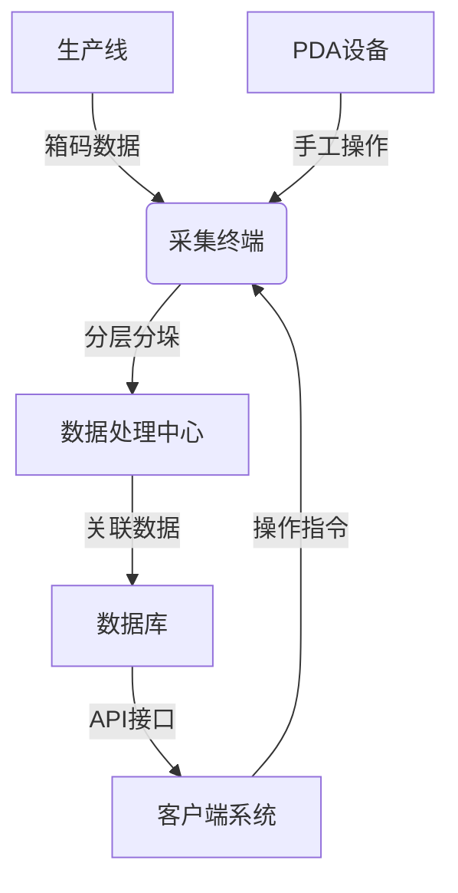
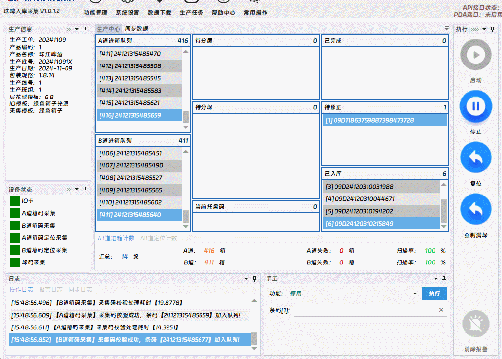
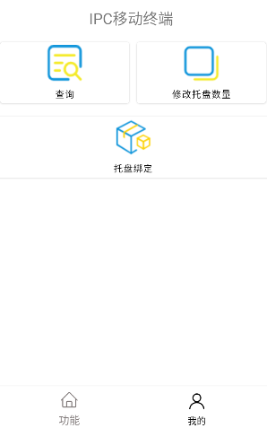

# 珠江啤酒入库采集系统

## 项目概述

珠江啤酒入库采集系统是针对啤酒生产线设计的智能化仓储管理系统，主要功能包括：

- 实时采集生产线箱码数据
- 自动分层分垛处理
- 托盘码绑定与关联
- 数据接口服务
- PDA辅助操作

## 系统架构



## 功能模块

### 1. 箱垛采集关联
- 实时采集AB道箱码
- 自动分层分垛处理
- 托盘码绑定
- 异常数据预警



### 2. PDA辅助操作
- 手工数据录入
- 异常处理
- 数据查询
- 系统配置



### 3. API接口服务

#### 接口规范
```json5
{
    "status_code": 200,
    "data": null,
    "message": "OK"
}
```

| 字段          | 类型     | 说明            |
| ----------- | ------ | ------------- |
| status_code | int    | 状态，200正常，其他异常 |
| data        | object | 响应数据          |
| message     | string | 状态信息          |

#### 3.1 获取托盘关联数据

**接口地址**
```bash
GET /api/prod/getlastpallet?barcode=托盘码
```

**请求示例**
```bash
curl -X GET "http://api.example.com/api/prod/getlastpallet?barcode=123456"
```

**响应示例**
```json5
{
    "status_code": 200,
    "data": [
        {
            "lv1Barcode": "24101213430813",
            "lv2Barcode": "24101213430872",
            "lv3Barcode": "24101213430871"
        },
        {
            "lv1Barcode": "24101213430843",
            "lv2Barcode": "24101213430872",
            "lv3Barcode": "24101213430871"
        }
    ],
    "message": "OK"
}
```

**字段说明**

| 字段         | 类型     | 说明  |
| ---------- | ------ | --- |
| lv1Barcode | string | 箱码  |
| lv2Barcode | string | 层码  |
| lv3Barcode | string | 垛码  |

#### 3.2 设置托盘码已入库

**接口地址**
```bash
POST /api/prod/setpalletinwarehouse
```

**请求参数**

| 参数名     | 类型   | 必填 | 说明   |
| -------- | ---- | -- | ---- |
| barcode  | string | 是  | 托盘码 |

**请求示例**
```bash
curl -X POST "http://api.example.com/api/prod/setpalletinwarehouse" \
-H "Content-Type: application/json" \
-d '{"barcode": "123456"}'
```

**响应示例**
```json5
{
    "status_code": 200,
    "data": "入库成功!",
    "message": "OK"
}
```
