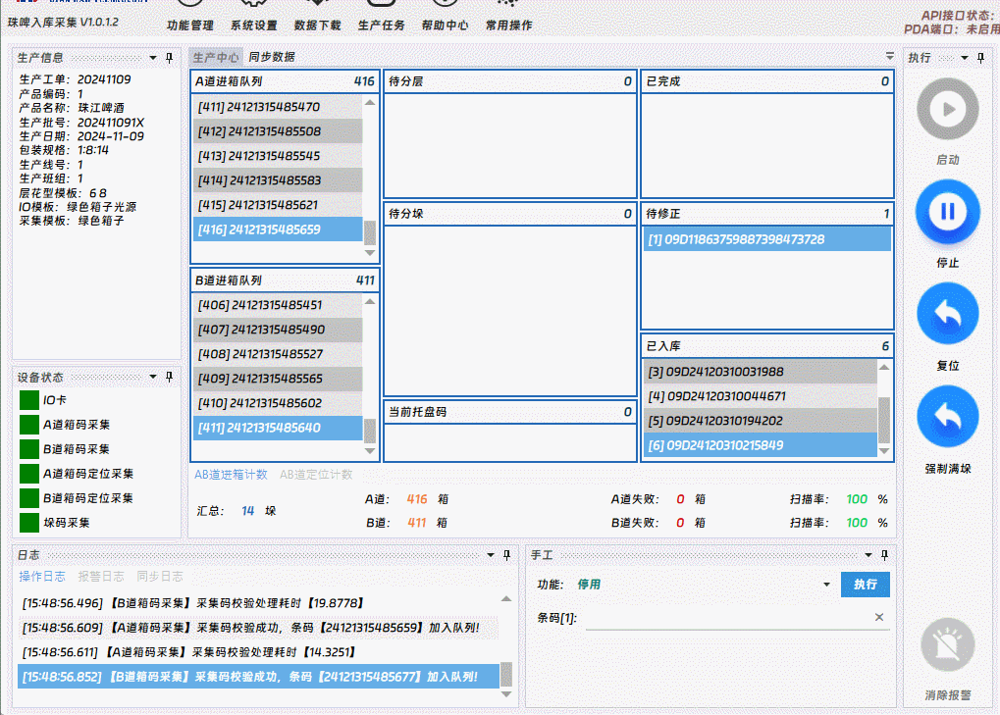
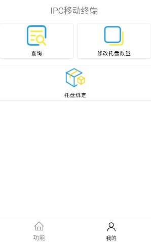

# 1 入库项目之一

应用简单说明采集AB道的箱码，根据产线信号及码垛机器人信号把箱码数据分层分垛及绑定托盘码，客户根据接口获取托盘完整的关联关系

## 1.1 箱垛采集关联软件



## 1.2 PDA手工操作软件



## 1.3 API接口服务软件

接口返回统一json格式

```json5
{
    "status_code": 200,
    "data": null,
    "message": "OK"
}
```

| 字段          | 类型     | 说明            |
| ----------- | ------ | ------------- |
| status_code | int    | 状态，200正常，其他异常 |
| data        | object | 数据            |
| message     | string | 信息            |

## 1.3.1 获取托盘关联数据

```json5
/api/prod/getlastpallet?barcode=托盘码
```

返回数据实列

```json5
{
    "status_code": 200,
    "data": [
        {
            "lv1Barcode": "24101213430813",
            "lv2Barcode": "24101213430872",
            "lv3Barcode": "24101213430871"
        },
          {
            "lv1Barcode": "24101213430843",
            "lv2Barcode": "24101213430872",
            "lv3Barcode": "24101213430871"
        },
          {
            "lv1Barcode": "24101213430845",
            "lv2Barcode": "24101213430872",
            "lv3Barcode": "24101213430871"
        }
    ],
    "message": "OK"
}
```

字段说明

| 字段         | 类型     | 说明  |
| ---------- | ------ | --- |
| lv1Barcode | string | 箱码  |
| lv2Barcode | string | 层码  |
| lv3Barcode | string | 垛码  |

## 1.3.2 设置托盘码已入库

```json5
/api/prod/setpalletinwarehouse?barcode=托盘码
```

返回数据实列

```json5
{
    "status_code": 200,
    "data": "入库成功!",
    "message": "OK"
}
```