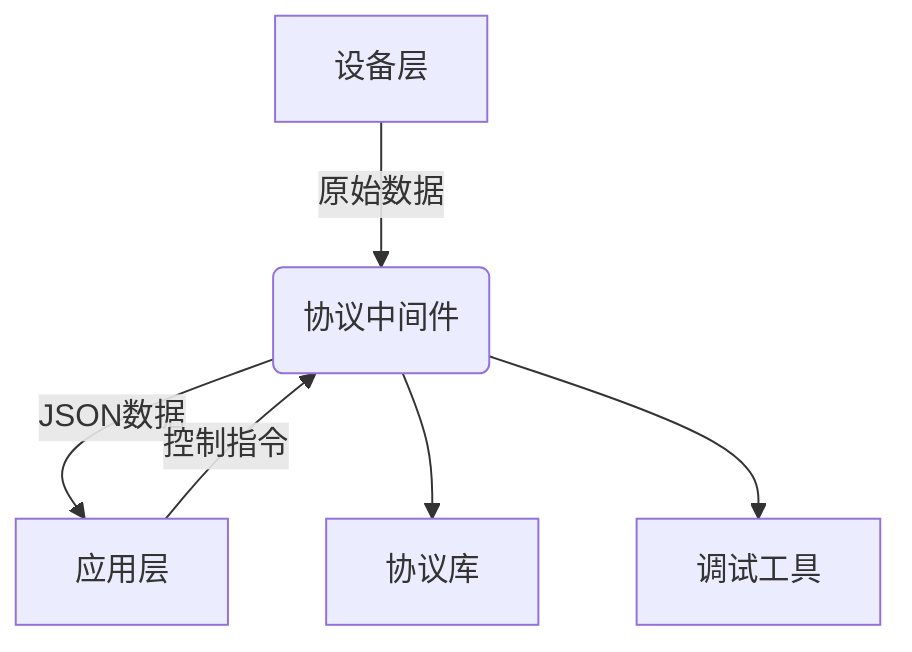

# 协议中间件

## 项目背景

在工业物联网场景中，设备通信协议多样化且复杂，传统开发方式存在以下痛点：
1. 协议解析代码重复开发
2. 不同设备协议格式不统一
3. 调试过程繁琐低效

为解决这些问题，我们开发了协议中间件，旨在提供统一的协议管理解决方案。

## 功能特点

- 协议定义：通过JSON格式定义设备通信协议
- 数据转换：支持JSON与16进制数据自动转换
- 调试工具：提供实时数据监控和调试功能

## 技术架构

## 开发计划

### 设备连接支持
- [x] 串口
- [x] HID  
- [ ] TCP (Q2 2025)
- [ ] UDP (Q3 2025)

### 标准协议支持
- [ ] Modbus (Q1 2025)
- [ ] S7 (Q2 2025)
- [ ] CAN (Q4 2025)

### 上层交互支持
- [x] SignalR
- [ ] MQTT (Q1 2025)
- [ ] WebSocket (Q2 2025)

[在线DEMO](https://raytang.cn/)
